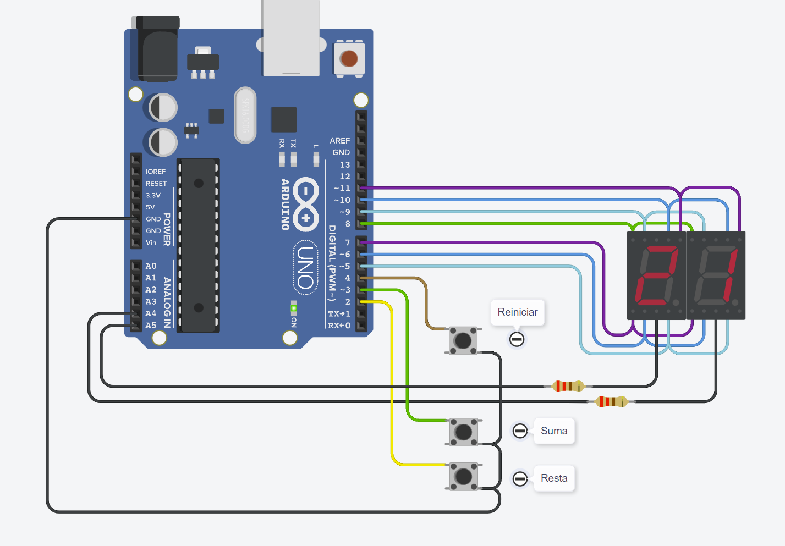
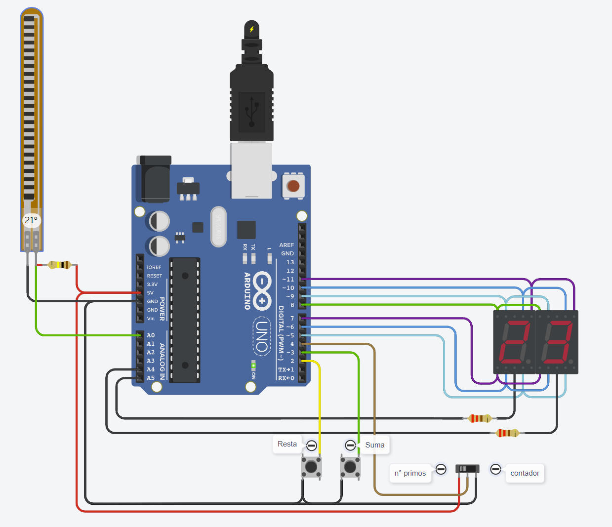
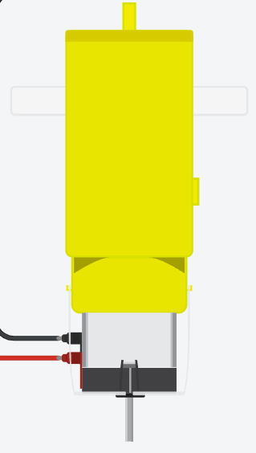
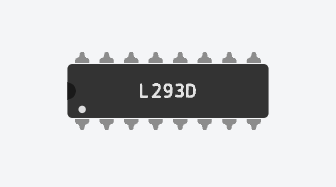
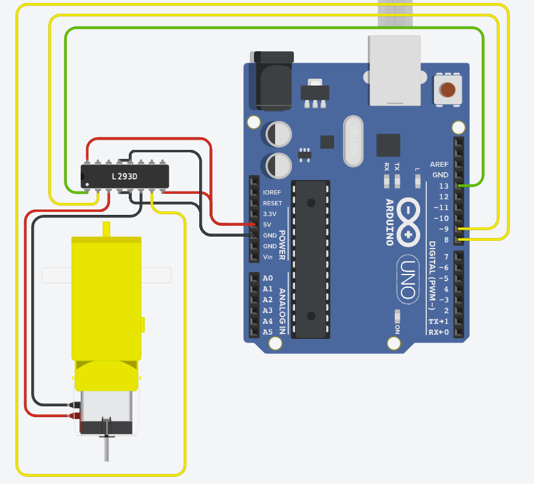
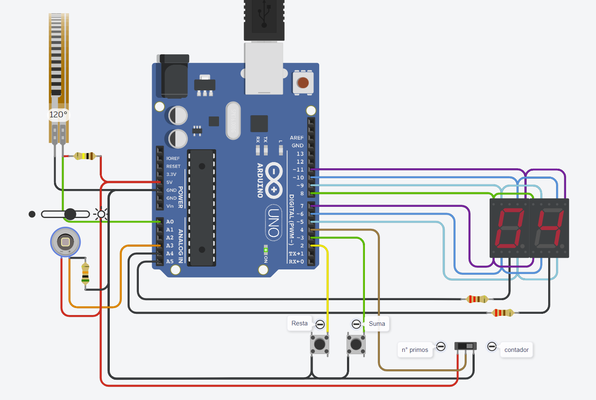
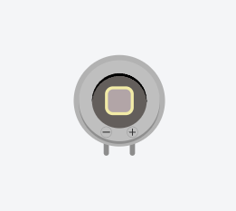

# PRIMER PARCIAL DE SPD

## INTEGRANTES
- Mauricio Gabriel Harriet Thery
- Belkis Yolanda Guanipa Lopez
- Cheimienst Hernández Gómez
  
## Primera parte: Controlar un contador con botones en un programa que utiliza 2 displays de 7 segmentos en multiplexación

## 1) Descripción
Este proyecto involucra la implementación de un contador utilizando dos visualizadores de siete segmentos. El control del contador se realiza mediante tres botones: uno para incrementar el contador, otro para disminuirlo y un tercero para restablecerlo. La estructura fundamental del código comprende los siguientes elementos:

1. Definición de nombres significativos para diversos valores, lo cual no solo mejora la legibilidad del código, sino también optimiza el uso de memoria.
2. Declaración de las variables necesarias para el desarrollo adecuado del programa.
3. Una función llamada `setup()` que configura los pines de entrada para los botones.
4. Una función llamada `loop()` que contiene la lógica principal del programa y se ejecuta continuamente mientras Arduino esté encendido.
5. Una función llamada `presionarPulsador()` que detecta si los botones se han presionado o no.
6. Una función llamada `apagarDisplay()` que se encarga de apagar todos los segmentos de los visualizadores.
7. Una función llamada `mostrarNumero()` que se encarga de activar los segmentos correspondientes en el visualizador.
8. Una función llamada `prendeDigito()` que permite activar los dígitos de unidades o decenas en los visualizadores.
9. Por último, una función llamada `mostrarContador()` que se encarga de presentar los valores de unidades y decenas en los visualizadores.

Además, en términos de la electrónica utilizada, se emplea la [multiplexación](https://www.uazuay.edu.ec/sistemas/teleprocesos/multiplexacion)  y evita problemas de ruido de señal, como el fenómeno conocido como ["debounce"](https://www.murkyrobot.com/guias/arduino/debounce) o ["efecto rebote"](https://www.murkyrobot.com/guias/arduino/debounce).

## 2) Enlace del proyecto
[SPD - Primer parcial - Parte 1](https://www.tinkercad.com/things/c6Y9zx44Fnb-copy-of-primera-parte-del-examen-de-spd/editel?sharecode=_g-j-M7_DWu3wRsHQ90MPSgqWQZF7gK58weqZ-hQx6w)

## Segunda Parte: Cambio de estado por medio de un interruptor deslizante +  sensor de flexión

## 1) Descripción

Para la parte 1, agregamos ahora un interruptor, donde su funcionamiento es alternar el estado entre, mostrar los números del contador de la misma manera que la parte 1, y mostrar de manera automática los números primos (números que solo sean divisibles por 1 y por si mismos) que se encuentren entre el rango de 0 a 99. Para esto, declaramos una función llamada `detectarPrimo()`

Además, se agregó un [sensor de flexión](https://rambal.com/presion-peso-nivel-flex/250-sensor-flex.html#:~:text=El%20Sensor%20Flex%20(%20Sensor%20de%20Flexiono%20o%20flex%20sensor)%20produce,distintos%20valores%20de%20resistencia%20electrica.), este dispositivo detecta la flexión o curvatura de un objeto, como un cable o una pieza flexible y entrega el angulo de inclinación. Para esto se declaró una función de nombre `mostrarAngulo()`.

## 2) Enlace del proyecto
[SPD - Primer parcial - Parte 2](https://www.tinkercad.com/things/hBZ97ZE6uDL-segunda-parte-del-examen-de-spd-parte-1/editel?sharecode=j5J0IRgQ8MvUgFu1s8G4YiuOi-3GZQqMK3ufEMskiOQ)

## 3) Sugerencia como componente adicional

Se le puede agregar al proyecto un "motor de aficionado", llamado así porque es un motor de cc (corriente continua) que se le acopló una carcasa para generar movimiento, ya sea para brazos, ruedas, helices, etc. Para tener más control sobre este, podemos incluir al proyecto un ["controlador de motor"](https://cursos.mcielectronics.cl/2022/08/05/que-es-un-puente-h/) o tambien llamado ["Puente H"](https://cursos.mcielectronics.cl/2022/08/05/que-es-un-puente-h/). En el siguiente enlace se enseña como podria usarse dicho motor y controlador en una placa arduino para controlar el sentido de giro del motor.

## Enlace del ejemplo
[Motor de "aficionado" con inversión de marcha por medio de un controlador](https://www.tinkercad.com/things/3DWHBq6tPv1-glorious-bombul/editel?sharecode=xVmE-y7X4gkLnzfS4gMHEVI4tN6mgUbmRkFmlm31f5o)

## Tercera Parte: Implementación de un fotodiodo en el proyecto

A la parte 2 le agregamos un [fotodiodo](https://como-funciona.co/fotodiodo/). Un fotodiodo es un dispositivo semiconductor que genera una corriente eléctrica cuando se expone a la luz. Esto se logra mediante la absorción de fotones de luz que liberan electrones en el material semiconductor. Estos electrones generan una corriente eléctrica detectable. Los fotodiodos son muy sensibles y tienen una respuesta rápida a cambios en la intensidad de la luz. Pueden estar diseñados para detectar luz en un rango específico del espectro electromagnético, como infrarrojo, ultravioleta o visible. Los fotodiodos se utilizan en aplicaciones que requieren alta sensibilidad y precisión, como en fotodetectores, comunicaciones ópticas, lectores de códigos de barras y sistemas de control automático.

## 2) Explicación de su funcionamiento

Desde su salida negativa (Cátodo) la alimentamos con 5V y desde su salida positiva (Ánodo) la conectamos ,a una entrada analogica de la placa de Arduino ,y a una resistencia de 50kOhm que esta conectada a Tierra (Podemos colocarle otro valor a la resistencia, pero en este caso decidimos colocarle ese valor para trabajar con ella, en el caso de querer colocar otra resistencia, hay que regular de vuelta todo). Ahora, por medio de una variable, en este caso `lectura_luz`, tomamos un rango de todos los valores que nos va dando el sensor a medida que incrementa o disminuye la intensidad luminica, en este caso, nos entrega un rango de (49 - 1023), por lo que para saber que porcentaje de intensidad luminica es, llamamos a otra variable, en este caso es `luz` utilizando la [función map()](https://arduinofacil.com/como-funciona-la-funcion-map/#:~:text=La%20función%20map()%20de,inicio%20rango%20de%20entrada) para poner esos valores entre un rango del 0% al 100%. Como resultado, ya hemos configurado nuestro fotodiodo. 

Algunos ejemplos de uso del fotodiodo son: 
1. Comunicaciones ópticas
2. Lectores de códigos de barras
3. Sensores de proximidad
4. Sistemas de seguridad y alarmas
5. Fotodetectores en experimentos científicos
6. Radiometría y fotometría
7. Detectores de infrarrojos (IR)
8. Detección de radiación UV
   

## 3) Enlace del proyecto
[SPD - Primer parcial - Parte 3](https://www.tinkercad.com/things/i2WYjdxy4Ad-tercera-parte-cambio-de-estado-por-medio-de-un-interruptor/editel?sharecode=Q4o8lk4AmnOYl5Bo9QZUgtl31wEAvNC7s81YJKjrU28)
